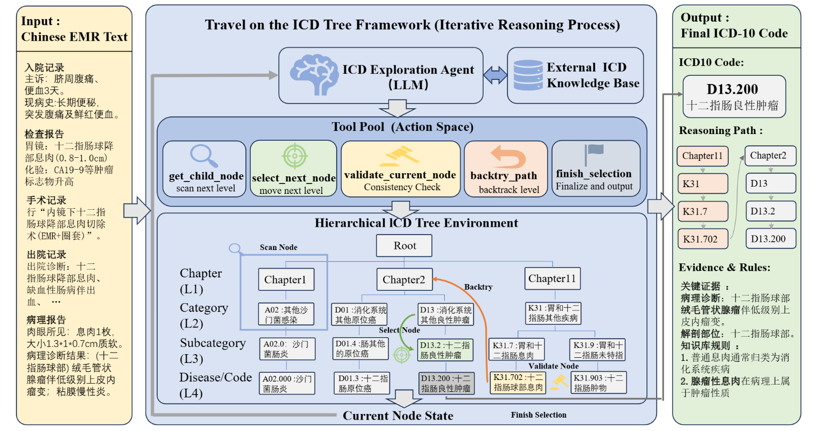

# Travel-on-the-ICD-Tree

## 项目简介

国际疾病分类（ICD）编码是医疗数据治理的关键标准，支撑着医院评价、医保结算及临床研究的运行。在实际应用中，编码员需要在复杂的ICD层级树中进行逻辑推理与规则比对。

本项研究提出了 **Travel on the ICD Tree** 框架，将ICD编码任务视为在ICD层级结构上的结构化探索过程，并引入基于Agent的工作流程，将相似度检索与层级导航相结合，为模型提供ICD编码规则信息。

## 核心架构

